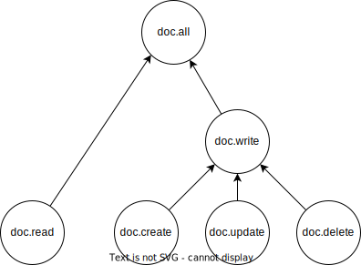
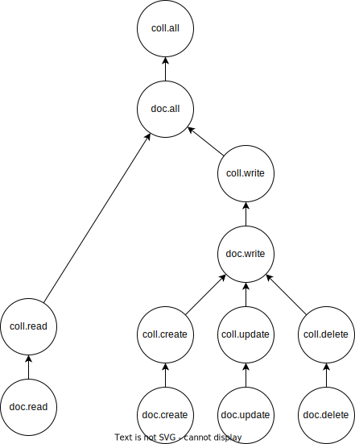

@trufflehq/perms
---

# Introduction

This package provides a simple, yet extensible way to manage permissions in your application.

# Getting started

## Installation

```bash
npm install @trufflehq/perms
```

or

```bash
yarn add @trufflehq/perms
```

## Basic usage

You can start evaluating permissions with minimal configuration. The following example shows how to evaluate whether or not a user has permission to view videos on a website.

```typescript
import { PermsProcessor, perm } from "../src";

// some users in our database
const user1 = {
  id: 1,
  name: "John Doe",

  // this user has the "videos.view" permission
  perms: [
    { action: "videos.view" }
  ]
}

const user2 = {
  id: 2,
  name: "Jack Smith",

  // this user does not have the "videos.view" permission
  perms: []
}

// initialize the permissions processor
const permsProcessor = new PermsProcessor();

// check if user1 has permission to view videos
permsProcessor.evaluate('videos.view', user1.perms) // true

// check if user2 has permission to view videos
permsProcessor.evaluate('videos.view', user2.perms) // false
```

# Advanced usage

## Custom permission evaluators

You can define custom permission evaluators to handle more complex permission logic. For example, you may want to define a permission evaluator that checks if a user has access to a certain document.

You can define a custom permission evaluator with the `permEval` function and then register it with the `PermsProcessor` instance.

```typescript
const permsProcessor = new PermsProcessor();

// define a custom permission evaluator
const evaluator = permEval({
  action: 'doc.read',

  // a custom function that only allows users with a permission
  // that matches the docId of the document they are trying to read
  hasPermission: (perm, context) => {
    return perm.params.docId === context.doc.docId;
  }
});

// register the custom permission evaluator
permsProcessor.register(evaluator);

// theoretical documents
const doc1 = { id: 1 };
const doc2 = { id: 2 };

// the perms for a theoretical user
const userPerms = [
  {
    action: 'doc.read',

    // the params in this permission specify
    // that the user has permission to read
    // the document with id 1
    params: { docId: 1 }
  },
];

// check if the user has permission to read doc1
permsProcessor.evaluate(
  'doc.read',
  userPerms,

  // we want to check if the user has permission
  // to read doc1, so we pass it into the context obj
  { doc: doc1 }
); // true

// check if the user has permission to read doc2
permsProcessor.evaluate('doc.read', userPerms, { doc: doc2 }); // false
```

Check out the full example in [examples/2-custom-eval.ts](examples/2-custom-eval.ts).

### Setting the global fallback evaluator

You can set a global fallback evaluator that gets used if by default if a user permission fails all other permissions checks.

```typescript
const permsProcessor = new PermsProcessor();
processor.globalFallback = permEval("superAdmin");

// these are perms that a theoretical user has.
// this user will have permission regardless of
// which action we're checking for
const userPerms = [
  perm("superAdmin"),
]
```

Check out the full example in [examples/6-global.ts](examples/6-global.ts).

## Inheritance

You can define permissions that inherit from other permissions. This is useful when you want to assume that a user has permission to do something if they have a higher level permission. There are two ways to define inherited permissions: PermEval chains and PermEval trees.

### PermEval chains

PermEval chains are a simple way to define inherited permissions. You can define a chain of permissions that inherit from each other with the `permChain` function. The following example shows how to define a chain of permissions that inherit from each other.

```typescript
const processor = new PermsProcessor();

processor.register(
  permEvalChain([ permEval("video.view"), permEval("video.rename"), permEval("video.delete") ])
);

const userPerms = [
  perm("video.rename"),
];

const testPerm = (perm: string) => {
  console.log(perm, processor.evaluate(perm, userPerms));
};

testPerm("video.view");
testPerm("video.rename");
testPerm("video.delete");

// output:
// video.view true
// video.rename true
// video.delete false
```

When using the `permEvalChain` function, permissions are ranked ascending from left to right, with the leftmost permission being the lowest level permission, and the rightmost permission being the highest level permission. If a user has the rightmost permission, they will also have all of the permissions to the left of it.

In this example, "video.view" is the lowest level permission. If a user has the "video.view" permission, they will be able to view the video, but not rename or delete it. However, if a user has the "video.delete" permission, they will also be able to view and rename the video.

Check out the full example in [examples/3-perm-chain.ts](examples/3-perm-chain.ts).

### PermEval trees

If you have a more complex hierarchy of permissions, you can define a PermEval tree. A PermEval tree is similar to a chain, but each node in the tree can have multiple children. The following example shows how you could define a tree for a document.



```typescript
processor.register(
  permEvalTree({
    self: permEval("doc.all"),
    children: [
      { self: permEval("doc.read") },
      {
        self: permEval("doc.write"),
        children: [
          { self: permEval("doc.create") },
          { self: permEval("doc.update") },
          { self: permEval("doc.delete") },
        ],
      },
    ],
  })
);
```

In this example, the "doc.all" permission is the highest level permission. If a user has the "doc.all" permission, they will also have all of the permissions in the tree. If a user has the "doc.write" permission, they will also have the "doc.create", "doc.update", and "doc.delete" permissions.

Check out the full example in [examples/4-perm-tree.ts](examples/4-perm-tree.ts).

One thing to keep in mind, is that permissions are evaluated from the bottom of the tree to the top. This means that your permissions tree may not look how you'd expect. [examples/5-collection.ts](examples/5-collection.ts) demonstrates an example where there can be multiple documents in a collection. If a user has a particular permission for a collection, they will also have that permission for all of the documents in the collection.

The permissions tree for that example looks like this:



## Gotchas

### Duplicate PermEvals

You cannot register duplicate PermEvals. One case you might accidentally do this is if you are using chains. For example, the following code will throw an error:

```typescript
const processor = new PermsProcessor();

processor.register(
  permEvalChain([
    permEval("doc.read"),
    permEval("doc.all"),
  ])
);

processor.register(
  permEvalChain([
    permEval("doc.write"),
    permEval("doc.all"),
  ])
);

// throws an error because "doc.all" is registered twice
```

In this case, you'd want to use a [PermEval tree](#permeval-trees) instead.