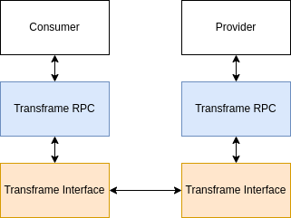

# Transframe

Have you ever needed to implement communication with an iframe? Or maybe you're
building a browser extension and you need to communicate between your content
script and your background script. You probably went on MDN or Stack Overflow
and found all the different ways of communicating (`window.postMessage`,
`chrome.runtime.sendMessage`, etc). You probably started using those and came up
with some janky method of serializing and deserializing messages that have weird
and inconsistent structures because you're just trying to get your app to work.
When you're all done, the communication mechanism you built becomes the most
fragile part of your app.

If this happened to you, look no further! Transframe has you covered. Transframe
allows you to easily create cross "frame" APIs!

(hence the name "transframe")

Truffle uses Transframe as the communication mechansim for the
[Truffle Extension](https://truffle.vip/extension). If you're not familiar with
it, you should check it out. It's super cool :p

Before I bore you with all of the details, let's see how you can get started
right away.

## Getting started

To get started, install Transframe with your favorite package manager.

```bash
$ npm install @trufflehq/transframe
$ yarn add @trufflehq/transframe
```

With every Transframe setup, there are two sides: a _provider_ and and a
_consumer_. A _provider_ provides an API that a _consumer_ can consume. Let's
take a look at how to set this up.

Script in parent page:

```typescript
import {
  createIframeProvider,
  createIframeApi
} from "@trufflehq/transframe/iframe";

createIframeProvider({
  api: createIframeApi({
    sayHello() {
      return "Hello!";
    },
  }),
});
```

Now for the script in the page to be iframed:

```typescript
import { createIframeConsumer } from "@trufflehq/transframe/iframe";

const transframeConsumer = createIframeConsumer();
const api = transframeConsumer.api;

const messageFromParent = await api.sayHello();
console.log("Message from parent:", messageFromParent);
// Output: Message from parent: Hello!
```

Congrats! You've implemented your first Transframe API and interacted with it.

### Passing args

```typescript
// provider script
createIframeProvider({
  api: createIframeApi({
    sum(_context, a: number, b: number) {
      return a + b;
    }
  })
});

// consumer script
const consumer = createIframeConsumer();
const onePlusTwo = await consumer.api.sum(1, 2); // 3
```

> The `_context` parameter contains information about the call to the API method. For the iframe interface, it contains a `message` property that is forwarded from `window.addEventListener` (see the [MDN docs](https://developer.mozilla.org/en-US/docs/Web/API/Window/postMessage#the_dispatched_event) for more details). `_context` is always the first parameter to API methods (though you will probably seldom use it).

### Callbacks

You can also pass callbacks to your API methods.
```typescript
// provider script
createIframeProvider({
  api: createIframeApi({
    subscribe(_context, callback: (iterations: number) => void) {
      let iterations = 0;

      setInterval(() => {
        callback(iterations);
        iterations++;
      }, 1000);
    }
  })
});

// consumer script
const consumer = createIframeConsumer();
consumer.api.subscribe((iterations: number) => {
  console.log(`I've been called ${iterations} times.`);
});

// Output:
// I've been called 0 times.
// I've been called 1 times.
// I've been called 2 times.
// ...
```

If you're interested in diving deeper, check out
[this example](https://github.com/trufflehq/truffle-packages/tree/master/npm/transframe/examples/multi-child).


## Architecture

At its core, Transframe is simply an RPC library. What makes it special is its ability to operate in different contexts using different *interfaces*. Under the hood, the iframe interface uses `window.postMessage` and `window.addEventListener('message', ...)`, while the background script interface uses the `Browser.runtime` api. If you wanted to, you could implement another interface to enable Transframe to work in another context. We haven't done it yet, but theoretically we could make a websocket interface 👀.

Here's a high-level diagram for those visual folks:



## Contexts

Here are different contexts that transframe can operate in. This is a non-exhaustive list, mainly because the iframe interface can be cleverly configured in lots of ways with the `providerWindow` option.

The following lists will be notated as "consumer -> provider".

### Iframe

> All of these can also work in reverse by correctly configuring the `providerWindow` option.

- Iframe -> Parent webpage
- Nested iframe -> Parent webpage
- Nested iframe -> Parent iframe
- Popup -> Popup opener webpage
- Webpage -> Browser extension content script

### Background script (browser extensions)
> Due to how this interface was implemented, the background script must always be the provider. Under the hood, it's using [this api](https://developer.mozilla.org/en-US/docs/Mozilla/Add-ons/WebExtensions/API/runtime/Port#:~:text=Content%20script%20to%20background%20script) (Content Script to Background Script).
- Content script -> Background script

## Configuring iframe consumers

I mentioned above that the iframe interface can be configured in lots of different contexts using the `providerWindow` option. This is done when creating an iframe consumer.

```typescript
const transframeConsumer = createIframeConsumer({
  providerWindow: window.parent
});
```

By default, it uses `window.top` as the provider window. This means that iframes and nested iframes will communicate with the top-most webpage. With the above code, nested iframes would communicate with the iframe just above it.

Here's a table that shows how to set `providerWindow` for different contexts:

| Context | `providerWindow` |
| ------- | ---------------- |
| Iframe -> Parent webpage | `undefined` |
| Nested iframe -> Parent webpage | `undefined` |
| Nested iframe -> Parent iframe | `window.parent` |
| Popup -> Popup opener webpage | `window.opener` |
| Webpage -> Browser extension content script | `window` |

## Namespaces

In a given context, it's possible to have multiple Transframe APIs. To avoid collisions and errors between these APIs, it's a best practice to always specify a namespace.

```typescript
// provider
createIframeProvider({
  api,
  namespace: 'my-api'
});

// consumer
createIframeConsumer({
  namespace: 'my-api'
});
```

## Security

Transframe has a few security features to help you ensure that only the intended consumers and providers are communicating with each other.

### Frame registration (iframe interface)

If you want to ensure that only certain iframes can use your API, you can use the `strictMode` option when creating an iframe provider and subesquently register frames that will be able to use your api.

```typescript
// provider
const provider = createIframeProvider({
  api,
  strictMode: true
});

// get a reference to the iframe you want to register
const iframe = document.getElementById('my-iframe');

// register the iframe
provider.registerFrame(iframe);
```

In this case, only the iframe with the id "my-iframe" will be able to use your API. If any other iframe tries to use it, it will fail.

Registering frames also causes `_context.fromId` to be defined in calls to your API methods, so you can uniquely identify the iframe that called your API method. Check out [this example](https://github.com/trufflehq/truffle-packages/tree/master/npm/transframe/examples/multi-child) for a demonstration of this.

### Origin verification (iframe interface)

If you want to ensure that only iframes from certain origins can use your API, you can use the `allowedOrigins` option when creating an iframe provider.

```typescript
// provider
createIframeProvider({
  api,
  allowedOrigins: ['https://my-website.com']
});
```

In this case, only iframes from `https://my-website.com` will be able to use your API. If any other iframe tries to use it, it will fail.

If you want to ensure that your consumer is not connecting to a malicious provider, you can use the `allowedOrigins` option when creating an iframe consumer.

```typescript
// consumer
createIframeConsumer({
  allowedOrigins: ['https://my-website.com']
});
```

In this case, the consumer will only send messages to origins specified in `allowedOrigins`. Under the hood, it's passing the origins you specify to `window.postMessage` (see the [docs](https://developer.mozilla.org/en-US/docs/Web/API/Window/postMessage#syntax)).

### Content scripts -> Background scripts

Due to how the background script interface was implemented, content scripts will only ever be able to communicate with background scripts in the same extension. So you can be sure that only content scripts that you write will be able to communicate with your background script.